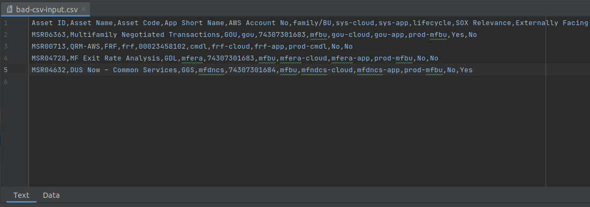
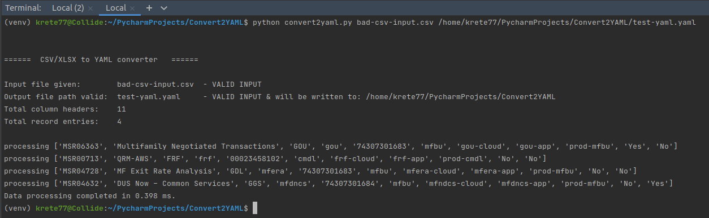
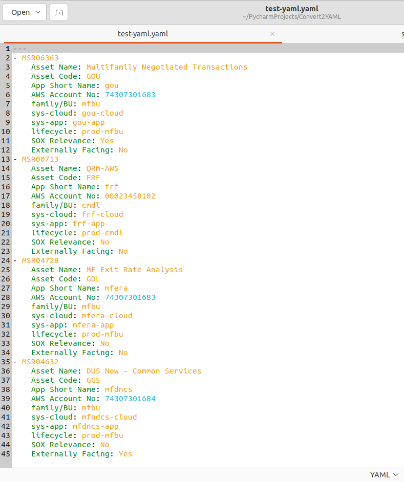

CSV/XLSX to YAML converter

## Table of contents
* [General info](#general-info)
* [Setup](#setup)
* [How to use](#how-to-use)
* [Output](#output)

## General info
Simple command line tool that requires two arguments. The first argument should be the CSV file that is being fed into
into the program. The second argument should be a valid path and filename. If no path is supplied for either, the present
working directory becomes the default working path. It will then analyze the CSV file, process and convert this data to a YAML format. 

## Setup
This script uses Pythons standard libraries that are bundled with the core Python distribution. You will need at least Python 3.9 installed on your operating system to ensure compatability. 
<br><br>
<i>Windows install:</i>
<a href="https://www.tutorialspoint.com/how-to-install-python-in-windows">How to install on Windows</a>

<i>Linux install:</i>
<a href="https://www.python.org/downloads/release/python-3910/">Source</a>

Additionally, you will be required to have the 'openpyxl' library installed to run this script. 
Once you have Python installed, from your terminal run: ```pip install pyopenxl```
This will install the library into your system. A further detailed explanation can be found <a href="https://www.softwaretestinghelp.com/python-openpyxl-tutorial/#How_To_Install_Openpyxl">here.</a>

## How to run
From the command line: <br>

To use a CSV file as input:<br>
```python convert2yaml.py {/path/to/name_of_csv_input_file.csv} {/path/to/output_yaml_file.yaml}```<br>
<br>
To use an XLSX file as input:<br>
```python convert2yaml.py {/path/to/name_of_csv_input_file.xlsx} {/path/to/output_yaml_file.yaml}```<br>

## Output
Initial CSV data input file given


Command line execution with results


Final conversion to YAML and formatting
